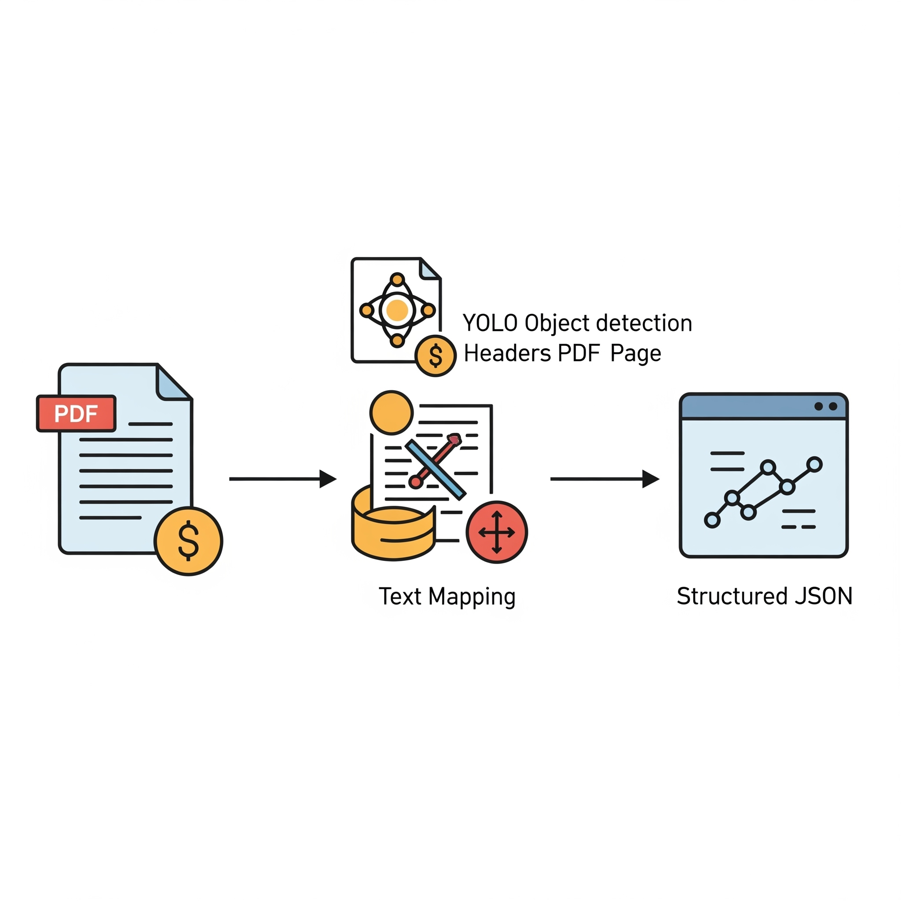
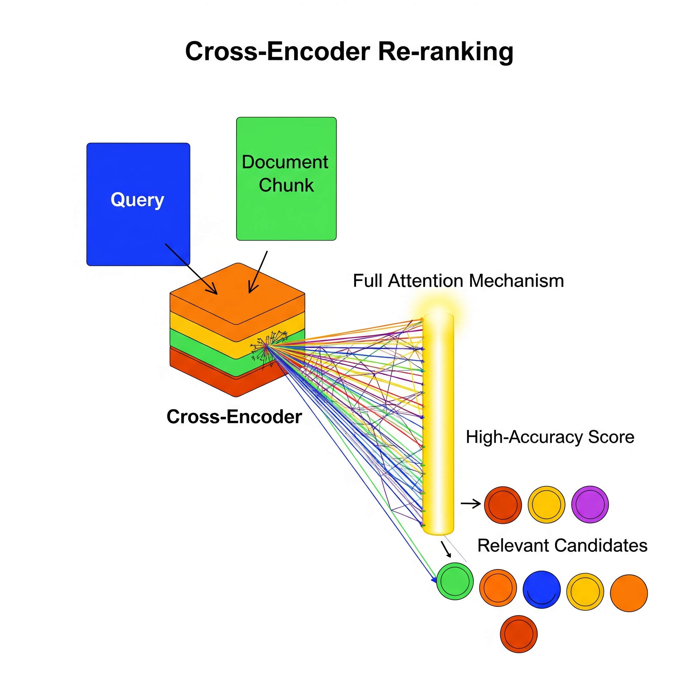
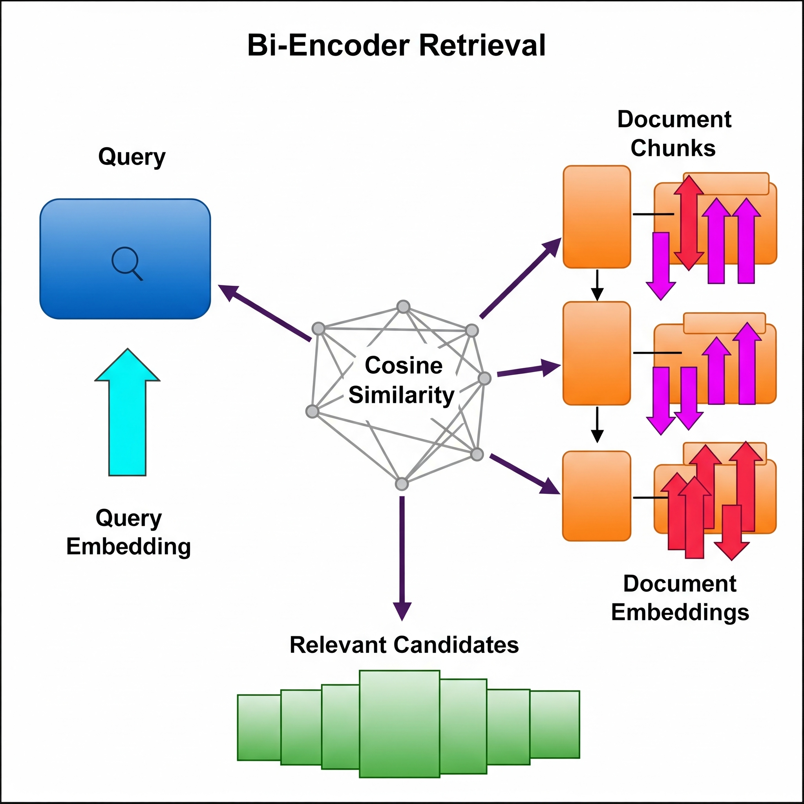

# Persona-Driven Document Intelligence Pipeline

## 1. Overview

This project implements a sophisticated, multi-stage pipeline for advanced document analysis. The system is designed to act as an intelligent analyst, ingesting a collection of PDF documents and extracting the most relevant sections based on a specific user **Persona** and their **Job-to-be-Done (JTBD)**.

The core of the system is a local, high-performance process that leverages a cascade of neural models to perform state-of-the-art retrieval, ranking, and content generation, all while adhering to strict performance and resource constraints.

---

## 2. Core Architecture & Pipeline

The system's architecture is a carefully designed pipeline that combines multiple AI techniques to achieve both speed and high-accuracy relevance ranking. Each stage filters or refines the data, ensuring the final output is both relevant and reliable.

### Stage 1: Layout-Aware Document Pre-processing

This step was already done in Round 1A. With a few tweaks, We got the whole layout and text together, which makes sense semantically.

* **Why It's a Superior Approach**: This method is vastly superior to simple text scraping because it preserves the **semantic structure** of the document. By understanding that a piece of text is a "Section-header," the system creates contextually coherent chunks, which dramatically improves the quality of the downstream relevance ranking.
* **What we did basically**: We used a detection model (which we trained on the DocLayNet dataset) to detect all the Section Headers. Half of the problem is solved there. If I know which are section headers, a simple rule-based system would do miracles as well.
* **What's smart about this**: We mapped the bounding boxes from YOLO and Fitz (PyMuPDF) to get the text, using a matrix transformation (pixels/DPI) to align the coordinate systems.

### Stage 2: Bi-Encoder Retrieval (Fast Candidate Generation)

Once the documents are chunked, they are indexed for fast retrieval using a bi-encoder architecture.

* **Technical Jargon**:
    * **Bi-Encoder**: A model architecture where the query and the documents are encoded into vector embeddings independently.
    * **Sentence Embeddings**: High-dimensional numerical representations of text, generated by the `BAAI/bge-small-en-v1.5` model.
    * **Vector Space Search**: An efficient search performed by calculating the **cosine similarity** between the query vector and all document chunk vectors to find the most semantically similar candidates.
* **Why It's a Superior Approach**: This stage is designed for speed and scale. By pre-calculating embeddings for all document chunks, the system can search a large corpus in milliseconds. It acts as a highly effective "fast filter" to reduce the search space from thousands of chunks to a few dozen relevant candidates.

### Stage 3: Cross-Encoder Re-ranking (High-Accuracy Scoring)

The candidates that pass the are then sent to a more powerful, computationally expensive cross-encoder model for fine-grained re-ranking.

* **Technical Jargon**:
    * **Cross-Encoder**: A model architecture (`cross-encoder/ms-marco-MiniLM-L-6-v2`) that processes the query and a document chunk *together* as a pair.
    * **Full Attention Mechanism**: Unlike a bi-encoder, the cross-encoder applies its attention mechanism across both the query and document simultaneously, allowing for a much deeper, token-level understanding of their relationship.
* **Why It's a Superior Approach**: This two-stage retrieve-and-rerank architecture is state-of-the-art. It combines the speed of the bi-encoder with the unparalleled accuracy of the cross-encoder. The cross-encoder acts as the "expert analyst," carefully scoring the handful of candidates selected by the fast retriever, ensuring the final ranking is of the highest possible relevance.

### Stage 4: Extractive Summarization (Reliable Content Generation)

To generate the final `refined_text`, the system uses an extractive approach with a powerful instruction-tuned model.

* **Technical Jargon**:
    * **Extractive Summarization**: A technique where the summary is generated by selecting and presenting the most important sentences or phrases from the source text, rather than generating new sentences.
    * **Instruction-Tuned LLM**: A model like `google/flan-t5-base` that has been trained to follow complex, human-language instructions.
* **Why It's a Superior Approach**: This method was chosen to maximize reliability and eliminate model "hallucination." By prompting the model to *extract* key sentences rather than *create* a new summary from scratch (abstractive summarization), we ensure the `refined_text` is directly grounded in the source document and avoids the "garbled" or "nonsensical" output that smaller abstractive models can produce.

---

## 3. Key Technical Decisions & Rationale

* **Optimized Model Selection**: Each model in the pipeline was chosen for its specific strengths while adhering to CPU-only and resource constraints:
    * **`bge-small-en-v1.5`**: Best-in-class performance for small retrieval embedding models.
    * **`ms-marco-MiniLM-L-6-v2`**: A highly efficient and effective cross-encoder for re-ranking.
    * **`flan-t5-base`**: A powerful instruction-following model that provides a balance of quality and performance for the extractive summarization task.

---

## 4. Setup & Installation

1.  **Clone the repository**:
    ```bash
    git clone <your-repo-url>
    cd <your-repo-name>
    ```
2.  **Create and activate a virtual environment**:
    ```bash
    python -m venv .venv
    source .venv/bin/activate
    ```
3.  **Install dependencies**:
    ```bash
    pip install -r requirements.txt
    ```
4.  **Download Models**: Clone the required model repositories into the `app/models/` directory.

---

## 5 Docker Execution 
```bash
# From the project root
docker build --platform linux/amd64 -t adobe-hackathon-2025:round1b .

```
## To process a new collection folder for a test case, you must add a new -v line to the docker run command. This maps your new folder from your computer into the container's /app directory, making it accessible to the utils.py script.
```bash
docker run --rm \
  -v ./'Collection 1':/app/'Collection 1' \
  -v ./'Collection 2':/app/'Collection 2' \
  -v ./'Collection 3':/app/'Collection 3' \
  document-processor
```
-v ./'Collection 1':/app/'Collection 1': Mounts your local data collection folder into the container. Add a new line like this for every test case folder you want to run.
